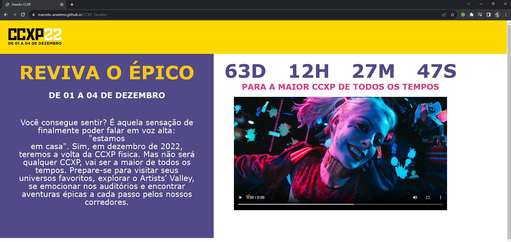

# CCXP_Desafio
O Desafio CCXP consiste em desenvolver uma <strong>LandingPage</strong> com algumas funcionalidades mais avançadas como <strong>CountDown</strong> de lançamento, utilização de layouts do <strong>figma</strong>, uso de <strong>grid & flexbox</strong> e etc...

## Licença

MIT

## Tecnologias Usadas
Nesse projeto utilizo das tecnologias
<ul>
    <li>HTML</li>
    <li>CSS</li>
    <li>JavaScript</li>
</ul>

## Site
[Desafio-CCXP](https://marcelo-anselmo.github.io/CCXP_Desafio/)

## Contato

<a href="https://www.linkedin.com/in/marcelo-anselmo-41587b280/" targuet="_blank">Linkedin</a>  
<a href="https://github.com/Marcelo-Anselmo" targuet="_blank">Github</a>
